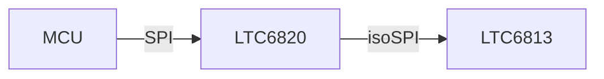

# BMS LTC6813 class

This is a BMS code written in Arduino made for [LTC6813](https://www.analog.com/en/products/ltc6813-1.html#product-samplebuy)
made by **Polimarche Racing Team -> EV unit** :heart: :electric_plug: :racing_car:

## Aim of the project

The code is written in **C++**, based on object programming, making it a **solid**, but most important **modular** software design.
More info at [**papers**](https://github.com/mrjacopong/BMS_LTC6813_class/tree/master/papers)

## Libraries

This project needs to the Linear Technology's libraries: "Linduino.h" "LT_SPI.h" "ltc681x.h" "ltc6813.h".
Download the [LTSketchbook](https://www.analog.com/media/en/engineering-tools/design-tools/LTSketchbook.zip), and unzip it in the Arduino's library folder of your computer.
More information available [HERE](https://github.com/analogdevicesinc/Linduino).

## Hardware

The comunication between Arduino and the LTC6813 follow the following diagram:

 - [LTC6820](https://www.analog.com/en/products/ltc6820.html) provides galvanic isolation and translates signals from SPI and isoSPI.
 - [LTC6813](https://www.analog.com/en/products/ltc6813-1.html#product-samplebuy) is the ADC Integrated Circuit

Communication  consists in sending an SPI signal from the MCU to LTC6813. The signal will be translated in isoSPI (the Linear proprietary communication protocol) and will be read by the ADC LTC6813.  

The SPI communication gives the flexibility to use any capable MCU.

### Currently used hardware 

|Hardware|Dev board|
|--|--|
|MCU|Linduino
|LTC6820|[DC1941D](https://www.analog.com/en/design-center/evaluation-hardware-and-software/evaluation-boards-kits/dc1941d.html)
|LTC6820|[DC2350A-b](https://www.analog.com/en/design-center/evaluation-hardware-and-software/evaluation-boards-kits/dc2350a-b.html)
|